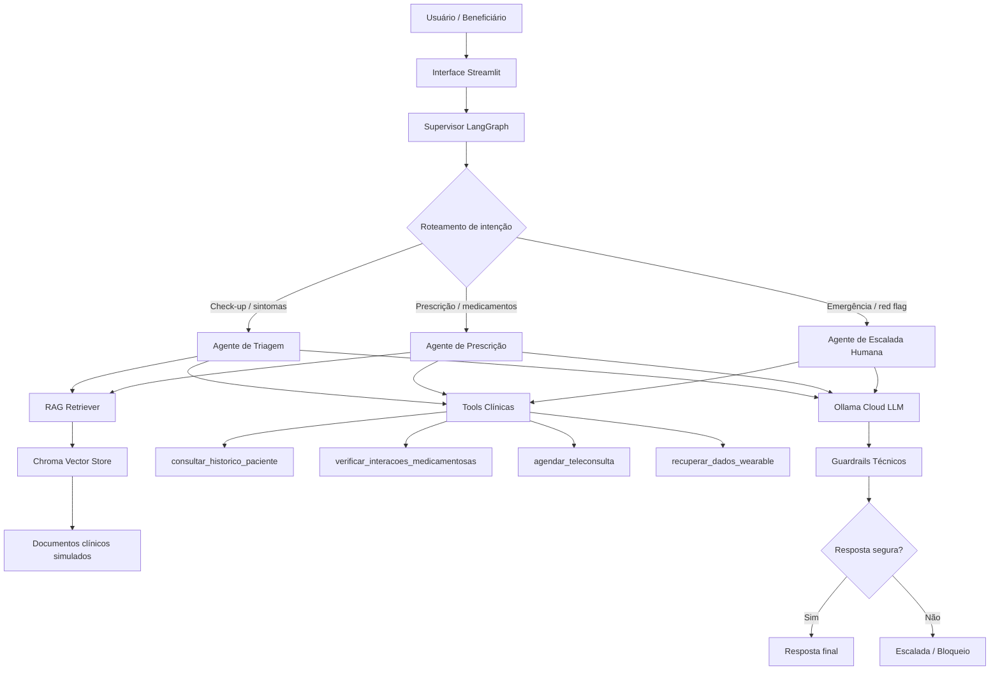

# BluaDiagnostics — Sprint 2 / Sprint 4

Sistema acadêmico de IA conversacional para cuidado remoto proativo no ecossistema Blua/Care Plus.

Esta entrega evolui a PoC da Sprint 1 para um sistema completo com:

- RAG funcional sobre base de conhecimento clínica simulada;
- arquitetura multi-agente com LangGraph;
- function calling com tools simuladas;
- guardrails clínicos;
- suite de evals automatizada;
- interface visual em Streamlit;
- relatório técnico final com métricas e análise crítica.

> **Modelo principal:** Ollama Cloud via `.env`  
> **Autenticação:** variável `OLLAMA_API_KEY`  
> **Motivo:** manter consistência com a PoC anterior, facilitar execução e evitar exposição de credenciais no GitHub.

---

## Integrantes

| Nome | RM |
|---|---|
| Matheus Moura da Silva | RM566782 |
| Kaue Souza Rodrigues | RM557716 |
| Murylo Silva Amaral | RM568241 |
| Pedro Henrique Camacho de Alencar | RM568071 |
| Igor Mota Marran | RM567823 |

---

## 1. Objetivo da Sprint

A Sprint 4 tem como objetivo evoluir a PoC inicial para um sistema funcional de engenharia de IA, contemplando:

1. RAG real;
2. multi-agente com LangGraph;
3. function calling;
4. guardrails;
5. interface demonstrável;
6. evals automatizados;
7. relatório técnico;
8. vídeo de demonstração.

---

## 2. Decisão técnica sobre o modelo

### Modelo principal: Ollama Cloud

O sistema foi configurado para execução principal com **Ollama Cloud** utilizando API key via `.env`.

Essa escolha foi feita porque:

- evita depender de instalação local do modelo pelo avaliador;
- mantém o mesmo ecossistema usado na PoC anterior;
- permite rodar em máquinas com poucos recursos;
- preserva as credenciais fora do GitHub;
- facilita execução em VSCode, Linux, Windows.
- mantém compatibilidade futura com execução local via Ollama, caso necessário.

### Configurações suportadas

| Modo | Uso | Observação |
|---|---|---|
| Ollama Cloud via `.env` | Modo oficial da entrega | Recomendado para correção e demonstração |
| Ollama local | Possível evolução futura | Exige `ollama serve` e modelo baixado |
| Execução sem chave não suportada | Requer chave Ollama configurada | Não é o modo principal da entrega |

A execução oficial requer `OLLAMA_API_KEY` configurada no arquivo `.env`.

---

## 3. Arquitetura final



---

## 4. Estrutura do projeto

```text
blua-diagnostics-sprint2/
├── app/
│   └── streamlit_app.py
├── data/
│   ├── knowledge_base/
│   └── mock/
├── docs/
│   ├── arquitetura_langgraph.md
│   └── relatorio_final.md
├── evals/
│   ├── sprint2_eval_set.json
│   ├── sprint2_results.json
│   └── sprint2_metrics.json
├── notebooks/
│   └── sprint2_demo.ipynb
├── src/
│   ├── agents/
│   ├── evals/
│   ├── graph/
│   ├── rag/
│   └── tools/
├── .env.example
├── .gitignore
├── README.md
├── requirements.txt
└── entrega_sprint2.txt
```

---

## 5. RAG funcional

O pipeline RAG implementa:

- carregamento dos documentos em `data/knowledge_base/`;
- chunking textual;
- embeddings com `sentence-transformers`;
- vector store com Chroma;
- retriever integrado ao fluxo dos agentes;
- retorno dos documentos recuperados nos evals e na interface.

### Popular vector store

```bash
python -m src.rag.build_vectorstore
```

Os documentos recuperados são exibidos na interface e salvos em `evals/sprint2_results.json`.

---

## 6. Multi-agente com LangGraph

O sistema utiliza LangGraph com:

- supervisor;
- agente de triagem;
- agente de prescrição;
- agente de escalada humana;
- roteamento condicional por intenção;
- estado compartilhado;
- trajetória de agentes registrada.

Estrutura mínima atendida:

```text
supervisor → [triagem | prescrição | escalada humana]
```

Além disso, a arquitetura inclui **3 agentes especializados**, atendendo ao diferencial de LangGraph com mais de 2 agentes.

---

## 7. Tools implementadas

Tools implementadas:

| Tool | Descrição |
|---|---|
| consultar_historico_paciente | Retorna histórico simulado da paciente Maria, 34 anos |
| verificar_interacoes_medicamentosas | Verifica interações com Losartana 50mg e outros medicamentos |
| agendar_teleconsulta | Simula agendamento com especialidade e prioridade |
| recuperar_dados_wearable | Retorna sinais vitais mockados de wearable |

Paciente simulado obrigatório:

```text
Maria, 34 anos
Histórico: hipertensão
Última consulta: 03/2026 com Dr. João
Uso contínuo: Losartana 50mg
```

---

## 8. Guardrails técnicos

O sistema implementa:

- detecção de red flags cardíacas;
- detecção de red flags neurológicas;
- detecção de red flags respiratórias;
- bloqueio de jailbreak;
- validação de escopo Care Plus;
- escalada automática para atendimento humano;
- proibição de diagnóstico definitivo;
- proibição de prescrição sem médico.

---

## 9. Suite de evals

Executar:

```bash
python -m src.evals.run_evals
```

Saídas geradas:

```text
evals/sprint2_results.json
evals/sprint2_metrics.json
```

Os resultados incluem:

- pergunta;
- resposta obtida;
- trajetória de agentes;
- tools chamadas;
- documentos recuperados pelo RAG;
- avaliação qualitativa;
- score numérico;
- tempo de resposta;
- custo estimado por conversa.

---

## 10. Interface Streamlit

Executar:

```bash
streamlit run app/streamlit_app.py
```

A interface demonstra:

- conversa com o agente;
- agente acionado;
- documentos recuperados pelo RAG;
- tools chamadas;
- guardrails;
- resposta final;
- trajetória do grafo.

---

## 11. Execução no Linux/macOS

```bash
python3 -m venv venv
source venv/bin/activate
pip install -r requirements.txt
cp .env.example .env
```

Edite o `.env`:

```env
OLLAMA_HOST=https://ollama.com
OLLAMA_MODEL=gpt-oss:120b
OLLAMA_API_KEY=sua_chave_ollama
CHROMA_DIR=chroma_db
```

Popular o vector store:

```bash
python -m src.rag.build_vectorstore
```

Executar interface:

```bash
streamlit run app/streamlit_app.py
```

Executar evals:

```bash
python -m src.evals.run_evals
```

---

## 12. Execução no Windows

```powershell
python -m venv venv
.\venv\Scripts\Activate.ps1
pip install -r requirements.txt
copy .env.example .env
```

Editar `.env`:

```env
OLLAMA_HOST=https://ollama.com
OLLAMA_MODEL=gpt-oss:120b
OLLAMA_API_KEY=sua_chave_ollama
CHROMA_DIR=chroma_db
```

Popular vector store:

```powershell
python -m src.rag.build_vectorstore
```

Executar Streamlit:

```powershell
streamlit run app/streamlit_app.py
```

Executar evals:

```powershell
python -m src.evals.run_evals
```

---

## 13. Variáveis de ambiente

```env
OLLAMA_HOST=https://ollama.com
OLLAMA_MODEL=gpt-oss:120b
OLLAMA_API_KEY=sua_chave_ollama
CHROMA_DIR=chroma_db
```

Nenhuma API key deve ser enviada ao GitHub.

---

## 14. Iterações realizadas

| Iteração | Alteração | Ganho esperado |
|---|---|---|
| v1 | Prompt único simples | Base funcional |
| v2 | Separação por agentes | Melhor roteamento |
| v3 | Inclusão de RAG | Respostas mais contextualizadas |
| v4 | Guardrails técnicos | Maior segurança clínica |
| v5 | Evals automatizados | Medição quantitativa |
| v6 | Streamlit | Demonstração visual |
| v7 | Ollama Cloud via `.env` | Execução mais simples e reproduzível |

---

## 15. Trade-offs

| Decisão | Benefício | Limitação |
|---|---|---|
| Ollama Cloud | Mais simples para avaliador rodar | Depende de chave configurada |
| Chroma | Simples e local | Menos robusto que Qdrant/Pinecone |
| Streamlit | Rápido para demo | Menos customizável que frontend dedicado |
| Tools mockadas | Seguro e acadêmico | Não integra sistemas reais |
| Dados simulados | Evita risco LGPD | Não representa produção real |

---

## 16. Vídeo de demonstração

O vídeo deve demonstrar:

1. fluxo de check-up digital;
2. documentos recuperados pelo RAG;
3. chamada de pelo menos 2 tools;
4. caso de red flag com escalada automática;
5. tentativa de jailbreak bloqueada.

Link do vídeo:

```text
INSERIR_LINK_YOUTUBE_NAO_LISTADO
```

---

## 17. Relatório técnico

Relatório final:

```text
docs/relatorio_final.md
```

---

## 18. Checklist da rubrica

| Critério | Onde está |
|---|---|
| RAG funcional | `src/rag/`, `data/knowledge_base/` |
| Vector store | `src/rag/build_vectorstore.py` |
| LangGraph multi-agente | `src/graph/` |
| 2+ agentes | `src/agents/` |
| Supervisor | `src/graph/clinical_graph.py` |
| Tools | `src/tools/` |
| Guardrails | `src/agents/guardrails.py` |
| Interface | `app/streamlit_app.py` |
| Evals | `src/evals/run_evals.py`, `evals/` |
| Relatório | `docs/relatorio_final.md` |
| Vídeo | link no TXT final |
| Segurança de chaves | `.env.example`, `.gitignore` |

---

## 19. Observação médica

Este projeto é uma PoC acadêmica. O sistema não substitui médico, não diagnostica e não prescreve medicamentos. Casos críticos são encaminhados para atendimento humano.
