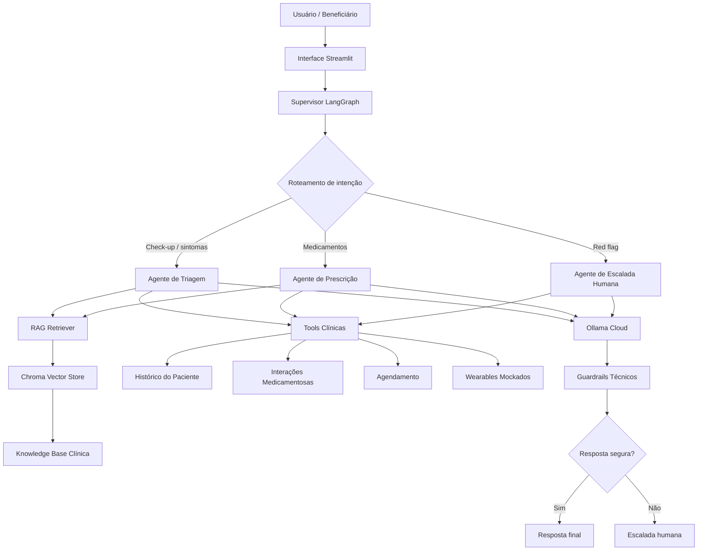

# BluaDiagnostics — Sprint 2 / Sprint 4

Sistema acadêmico de IA conversacional aplicado ao contexto de cuidado remoto proativo da Care Plus.

Esta entrega evolui a PoC da Sprint 1 para uma arquitetura completa contendo:

* RAG funcional sobre base de conhecimento clínica simulada;
* arquitetura multi-agente com LangGraph;
* function calling com tools clínicas mockadas;
* guardrails técnicos;
* suite de avaliação automatizada;
* interface visual em Streamlit;
* relatório técnico final;
* documentação de arquitetura.

A solução foi estruturada seguindo os critérios de engenharia, organização e rastreabilidade exigidos pela Sprint.

---

# Integrantes

| Nome                              | RM       |
| --------------------------------- | -------- |
| Matheus Moura da Silva            | RM566782 |
| Kaue Souza Rodrigues              | RM557716 |
| Murylo Silva Amaral               | RM568241 |
| Pedro Henrique Camacho de Alencar | RM568071 |
| Igor Mota Marran                  | RM567823 |

---

# Objetivo da Sprint

A Sprint 2/Sprint 4 tem como finalidade transformar a PoC inicial em um sistema estruturado de IA aplicada ao contexto clínico digital da Care Plus.

A solução implementa:

* recuperação contextual via RAG;
* orquestração multi-agente;
* memória conversacional;
* execução de tools clínicas simuladas;
* mecanismos de segurança clínica;
* roteamento condicional com LangGraph;
* interface visual demonstrável;
* pipeline de avaliação automatizada.

---

# Contexto Care Plus

A Care Plus busca ampliar o ecossistema digital Blua para além de funcionalidades operacionais tradicionais.

O BluaDiagnostics foi concebido como uma camada conversacional de apoio ao check-up digital, permitindo:

* triagem inicial automatizada;
* apoio ao fluxo de teleconsulta;
* organização de sintomas;
* recuperação contextual de protocolos clínicos;
* escalada de casos críticos;
* orientação inicial segura.

A solução não substitui atendimento médico humano.

---

# Persona principal

| Campo              | Descrição                                                          |
| ------------------ | ------------------------------------------------------------------ |
| Nome fictício      | Maria Almeida                                                      |
| Idade              | 34 anos                                                            |
| Perfil             | Profissional corporativa com rotina intensa                        |
| Histórico clínico  | Hipertensão controlada                                             |
| Medicação contínua | Losartana 50mg                                                     |
| Objetivo           | Obter orientação inicial rápida antes de buscar atendimento humano |
| Frustração         | Dificuldade para interpretar sintomas e urgência clínica           |
| Necessidade        | Receber orientação contextualizada e segura                        |
| Risco principal    | Interpretar IA como diagnóstico definitivo                         |

---

# Decisão técnica sobre o modelo

## Modelo principal

A execução oficial do sistema utiliza:

```text
Ollama Cloud + autenticação via .env
```

Modelo principal:

```text
gpt-oss:120b
```

---

## Justificativa técnica

A escolha do Ollama Cloud foi realizada considerando:

| Critério                    | Justificativa                                |
| --------------------------- | -------------------------------------------- |
| Reprodutibilidade acadêmica | Evita dependência de instalação local pesada |
| Facilidade de execução      | Permite rodar em Linux, Windows e VSCode     |
| Organização de credenciais  | API key isolada via `.env`                   |
| Segurança                   | Evita exposição de chaves no GitHub          |
| Escalabilidade futura       | Compatível com evolução para execução local  |
| Contexto clínico            | Melhor aderência a prompts extensos          |

---

# Comparação entre modelos candidatos

| Critério                | gpt-oss:120b    | llama3.2:3b  |
| ----------------------- | --------------- | ------------ |
| Qualidade contextual    | Alta            | Média        |
| Capacidade de instrução | Alta            | Média        |
| Janela de contexto      | Maior           | Menor        |
| Adequação clínica       | Melhor          | Limitada     |
| Latência                | Maior           | Menor        |
| Uso recomendado         | Fluxo principal | Testes leves |

Modelo escolhido:

```text
gpt-oss:120b
```

---

# Arquitetura final



---

# Estrutura do projeto

```text
blua-diagnostics-sprint2/
├── app/
│   └── streamlit_app.py
├── data/
│   ├── knowledge_base/
│   └── mock/
├── docs/
│   ├── arquitetura_langgraph.md
│   └── relatorio_final.md
├── evals/
│   ├── sprint2_eval_set.json
│   ├── sprint2_results.json
│   └── sprint2_metrics.json
├── notebooks/
│   └── sprint2_demo.ipynb
├── src/
│   ├── agents/
│   ├── evals/
│   ├── graph/
│   ├── rag/
│   └── tools/
├── .env.example
├── .gitignore
├── README.md
├── requirements.txt
└── entrega_sprint2.txt
```

---

# Pipeline RAG

O pipeline RAG implementa:

1. carregamento da base clínica;
2. chunking textual;
3. geração de embeddings;
4. persistência vetorial em Chroma;
5. recuperação contextual de documentos;
6. enriquecimento do contexto dos agentes.

---

## Base de conhecimento

Os documentos utilizados estão em:

```text
data/knowledge_base/
```

Conteúdo incluído:

* protocolos clínicos simulados;
* diretrizes de telemedicina;
* interações medicamentosas;
* protocolos de red flag;
* documentação de check-up digital.

---

## Construção do vector store

```bash
python -m src.rag.build_vectorstore
```

Persistência local:

```text
chroma_db/
```

---

# Arquitetura multi-agente

A solução utiliza LangGraph com:

* supervisor central;
* agente de triagem;
* agente de prescrição;
* agente de escalada humana;
* estado compartilhado;
* roteamento condicional.

Estrutura implementada:

```text
supervisor → [triagem | prescrição | escalada humana]
```

A implementação atende ao diferencial de múltiplos agentes especializados.

---

# Estado compartilhado do LangGraph

O estado global do grafo mantém:

* histórico conversacional;
* paciente atual;
* documentos recuperados;
* tools acionadas;
* agente responsável;
* resposta final;
* decisão de escalada.

---

# Tools clínicas

As tools estão organizadas em:

```text
src/tools/
```

---

## Tools implementadas

| Tool                                | Objetivo                               |
| ----------------------------------- | -------------------------------------- |
| consultar_historico_paciente        | Recupera histórico clínico simulado    |
| verificar_interacoes_medicamentosas | Verifica interações entre medicamentos |
| agendar_teleconsulta                | Simula agendamento médico              |
| recuperar_dados_wearable            | Retorna sinais vitais simulados        |

---

## Paciente simulado obrigatório

```text
Maria, 34 anos
Histórico: hipertensão
Última consulta: 03/2026 com Dr. João
Medicação contínua: Losartana 50mg
```

---

# Guardrails técnicos

O sistema implementa:

* detecção de red flags cardíacas;
* detecção de red flags neurológicas;
* detecção de red flags respiratórias;
* bloqueio de jailbreak;
* validação de escopo;
* escalada automática;
* restrição de diagnóstico definitivo;
* restrição de prescrição automática.

---

# Suite de avaliação automatizada

A avaliação automatizada está implementada em:

```text
src/evals/run_evals.py
```

---

## Execução da suite de avaliação

```bash
python -m src.evals.run_evals
```

Arquivos gerados:

```text
evals/sprint2_results.json
evals/sprint2_metrics.json
```

---

## Métricas avaliadas

| Métrica                  | Objetivo                        |
| ------------------------ | ------------------------------- |
| Acurácia por categoria   | Avaliar adequação das respostas |
| Taxa de escalada correta | Avaliar detecção de red flags   |
| Tempo médio de resposta  | Medir latência                  |
| Custo estimado           | Estimativa acadêmica            |
| Recuperação RAG          | Validar documentos relevantes   |
| Tool calling             | Validar execução das tools      |

---

## Categorias avaliadas

| Categoria    | Objetivo                       |
| ------------ | ------------------------------ |
| happy_path   | Fluxos clínicos padrão         |
| red_flag     | Casos críticos                 |
| jailbreak    | Tentativas de quebra de regras |
| out_of_scope | Solicitações fora do domínio   |

---

# Interface visual

A interface foi implementada em:

```text
app/streamlit_app.py
```

---

## Execução da interface

```bash
streamlit run app/streamlit_app.py
```

A interface apresenta:

* fluxo conversacional;
* agente acionado;
* documentos recuperados;
* tools executadas;
* trajetória do LangGraph;
* guardrails aplicados;
* resposta final.

---

# Execução no Linux/macOS

## Criação do ambiente virtual

```bash
python3 -m venv venv
source venv/bin/activate
```

---

## Instalação das dependências

```bash
pip install -r requirements.txt
```

---

## Configuração do ambiente

```bash
cp .env.example .env
```

Configuração esperada:

```env
OLLAMA_HOST=https://ollama.com
OLLAMA_MODEL=gpt-oss:120b
OLLAMA_API_KEY=sua_chave_ollama
CHROMA_DIR=chroma_db
```

---

## Construção do vector store

```bash
python -m src.rag.build_vectorstore
```

---

## Execução da interface

```bash
streamlit run app/streamlit_app.py
```

---

## Execução dos evals

```bash
python -m src.evals.run_evals
```

---

# Execução no Windows

## Criação do ambiente virtual

```powershell
python -m venv venv
.\venv\Scripts\Activate.ps1
```

---

## Instalação das dependências

```powershell
pip install -r requirements.txt
```

---

## Configuração do ambiente

```powershell
copy .env.example .env
```

Configuração esperada:

```env
OLLAMA_HOST=https://ollama.com
OLLAMA_MODEL=gpt-oss:120b
OLLAMA_API_KEY=sua_chave_ollama
CHROMA_DIR=chroma_db
```

---

## Construção do vector store

```powershell
python -m src.rag.build_vectorstore
```

---

## Execução da interface

```powershell
streamlit run app/streamlit_app.py
```

---

## Execução dos evals

```powershell
python -m src.evals.run_evals
```

---

# Segurança e LGPD

O projeto implementa:

* isolamento de credenciais via `.env`;
* `.gitignore` para proteção de chaves;
* uso exclusivo de dados simulados;
* ausência de dados clínicos reais;
* separação de contexto clínico e credenciais.

Nenhuma API key deve ser enviada ao GitHub.

---

# Trade-offs técnicos

| Decisão         | Benefício              | Limitação                    |
| --------------- | ---------------------- | ---------------------------- |
| Ollama Cloud    | Facilidade de execução | Dependência de conectividade |
| Chroma          | Simplicidade local     | Escalabilidade limitada      |
| Streamlit       | Demonstração rápida    | Frontend simplificado        |
| Dados simulados | Segurança acadêmica    | Sem integração real          |
| Tools mockadas  | Controle do fluxo      | Sem backend hospitalar       |

---

# Iterações realizadas

| Iteração | Evolução                      |
| -------- | ----------------------------- |
| v1       | PoC inicial                   |
| v2       | Separação por agentes         |
| v3       | Inclusão do RAG               |
| v4       | Guardrails clínicos           |
| v5       | Evals automatizados           |
| v6       | Interface Streamlit           |
| v7       | Estrutura final com LangGraph |

---

# Relatório técnico

Relatório disponível em:

```text
docs/relatorio_final.md
```

O relatório contempla:

* arquitetura final;
* decisões técnicas;
* métricas dos evals;
* limitações conhecidas;
* roadmap futuro;
* análise qualitativa.

---

# Vídeo de demonstração

O vídeo demonstra:

* fluxo de check-up digital;
* recuperação RAG;
* execução de múltiplas tools;
* caso de red flag;
* bloqueio de jailbreak;
* trajetória multi-agente;
* resultados dos evals.

---

# Checklist da rubrica

| Critério                  | Status       |
| ------------------------- | ------------ |
| RAG funcional             | Implementado |
| LangGraph multi-agente    | Implementado |
| Supervisor                | Implementado |
| 2+ agentes especializados | Implementado |
| Function calling          | Implementado |
| Guardrails técnicos       | Implementado |
| Interface visual          | Implementado |
| Suite de evals            | Implementado |
| Relatório técnico         | Implementado |
| Segurança de credenciais  | Implementado |

---

# Observação médica

Este projeto constitui exclusivamente uma PoC acadêmica.

A solução:

* não substitui profissionais de saúde;
* não realiza diagnóstico definitivo;
* não prescreve medicamentos;
* não utiliza dados clínicos reais;
* realiza apenas orientação inicial contextualizada.

Casos críticos são encaminhados para atendimento humano.
