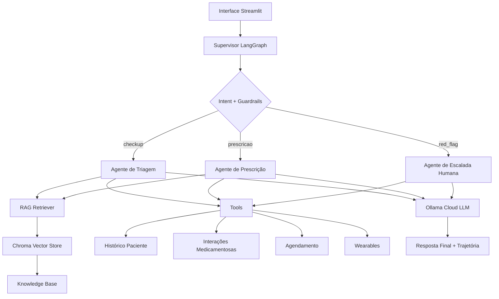

# Arquitetura LangGraph — BluaDiagnostics

## Estado compartilhado

O estado do grafo mantém:

- mensagem do usuário;
- paciente atual;
- histórico da conversa;
- documentos recuperados;
- tools chamadas;
- agente acionado;
- resposta final;
- decisão de escalada.

## Roteamento

- sintomas gerais → triagem;
- medicamentos/prescrição → prescrição;
- dor no peito/falta de ar/desmaio/sintomas neurológicos → escalada humana;
- jailbreak/out_of_scope → bloqueio por guardrail.
